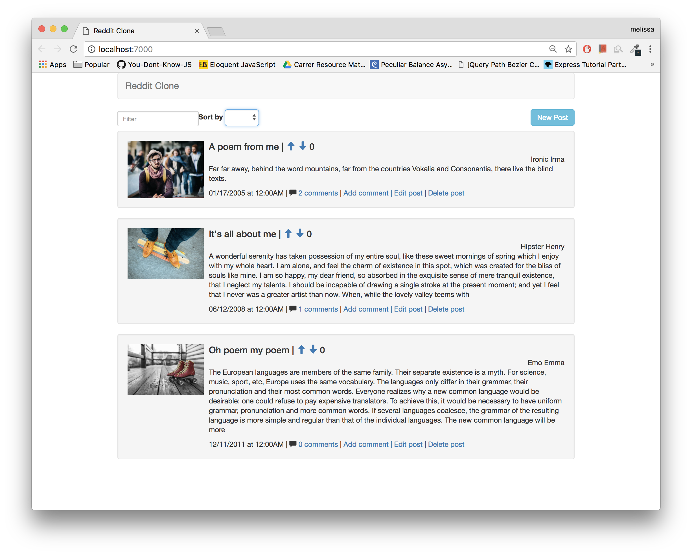
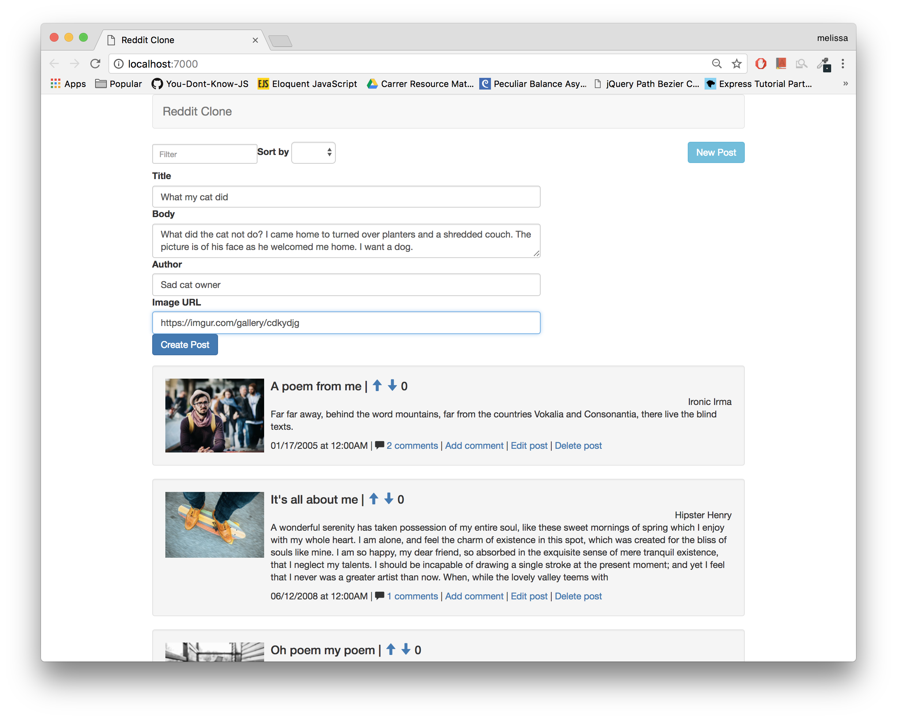
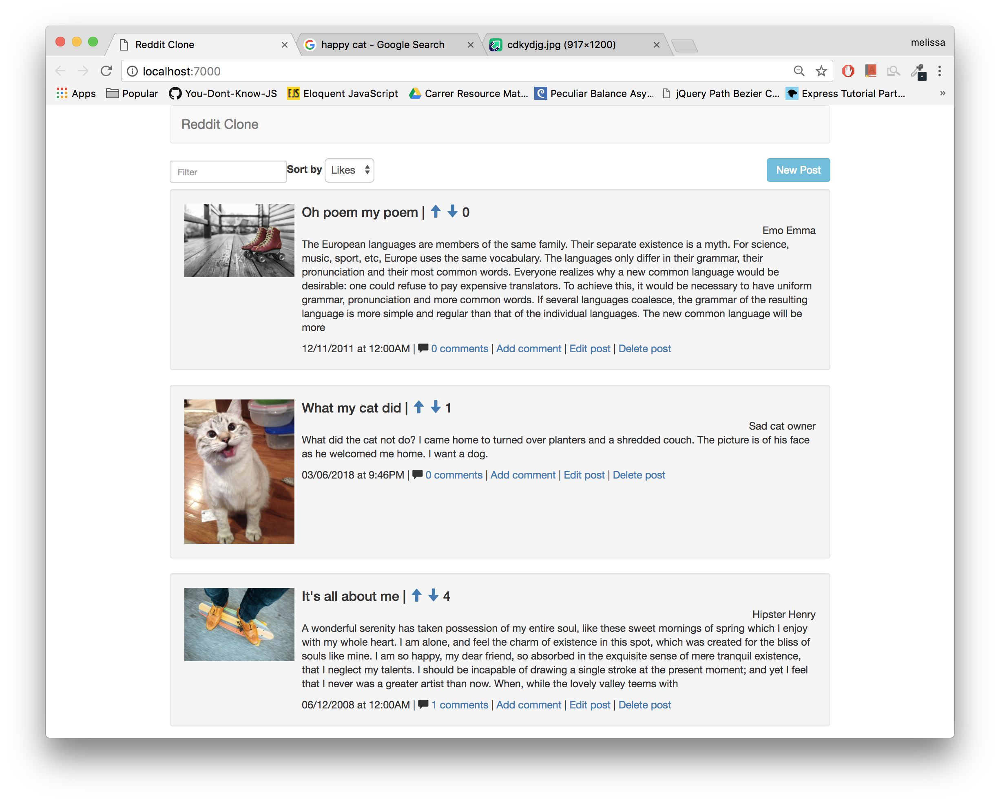
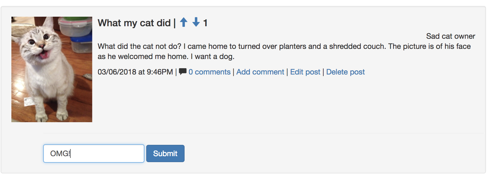
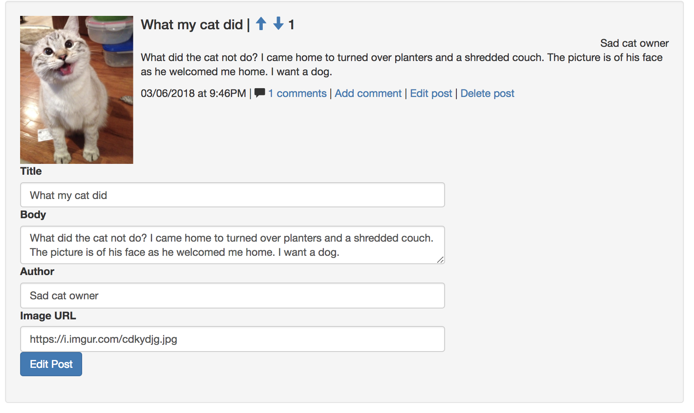

# Reddit Clone With Server
Unfamiliar environment project recreating the Reddit website using Angular.  

# Objectives
- Create an Angular application that allows users to CRUD data from a server.
- Using provided express routes and postgres database, create all necessary components and services to make a functioning Angular application.

# Screenshots of working app

## Setup

Run `yarn` and `npm start` to see the app locally.

Run `npm test` to run the tests.

> Check the "test/screenshots" folder for examples of what each test is looking for.
